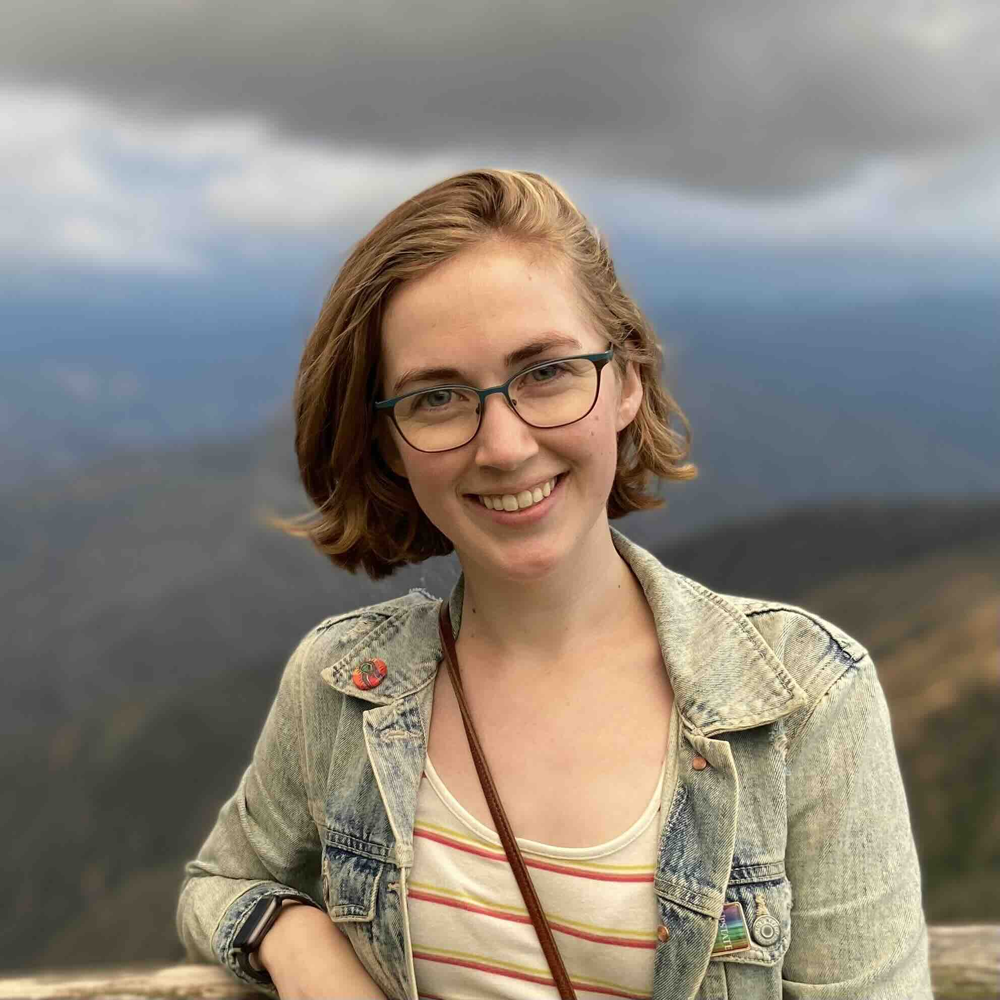
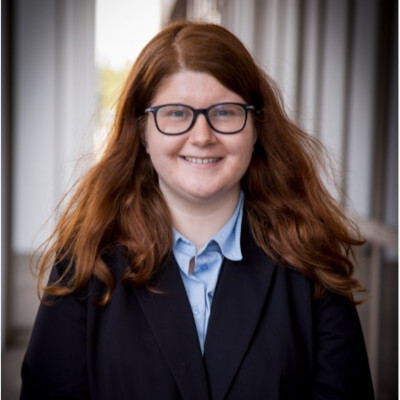
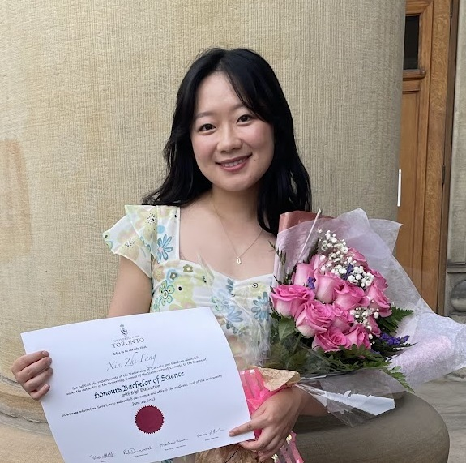
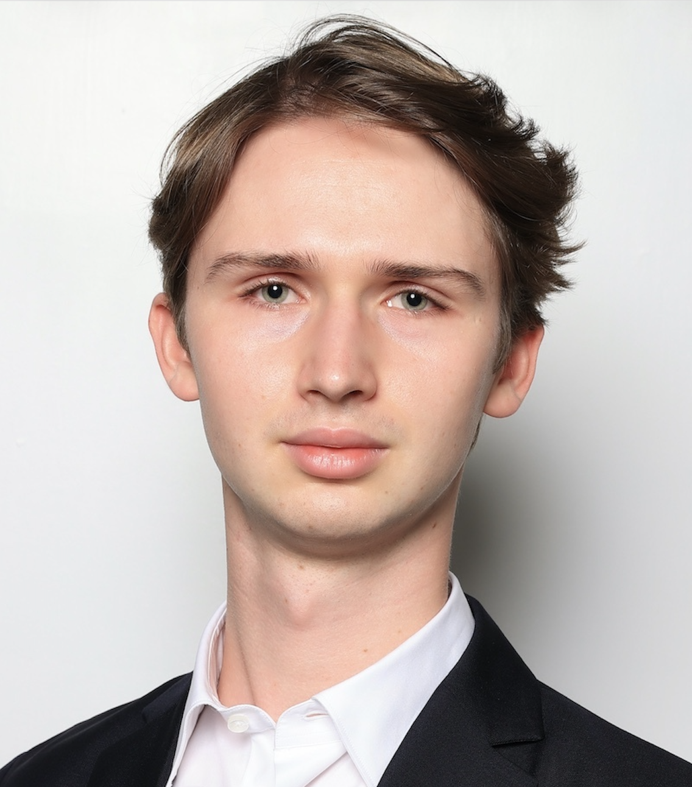
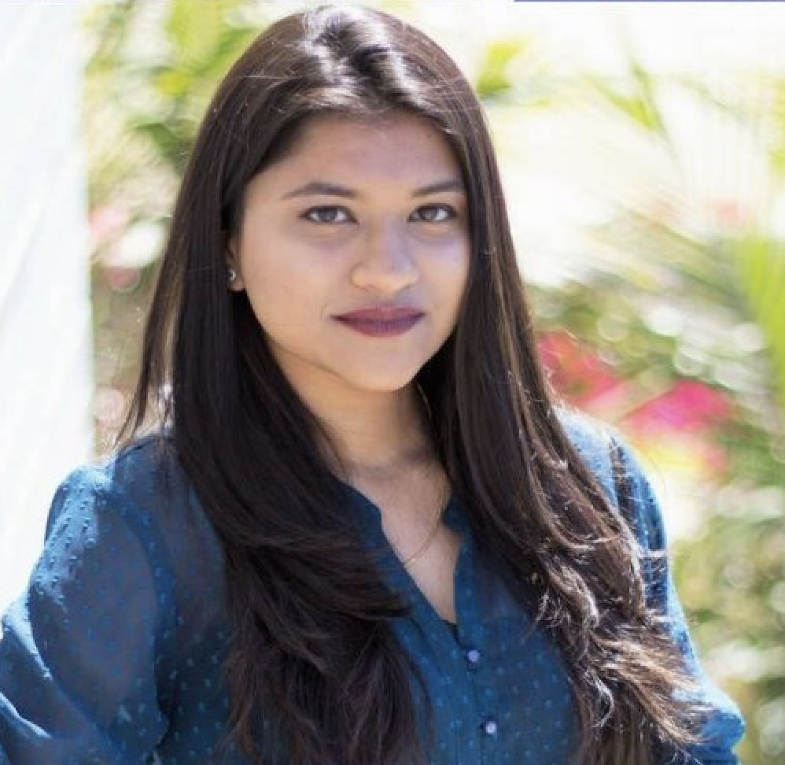
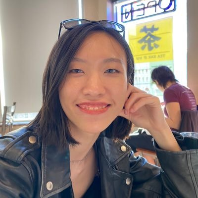
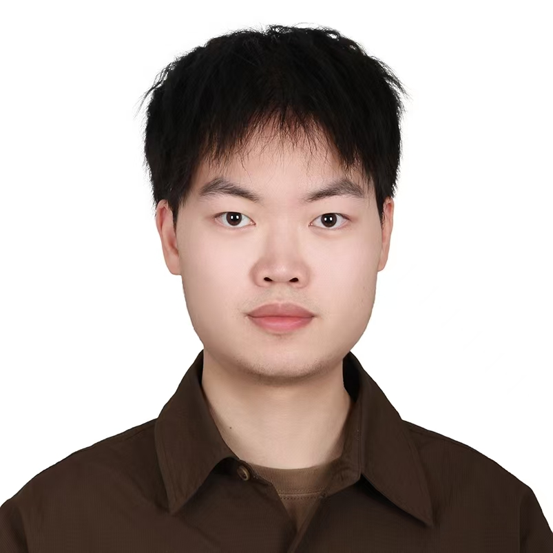
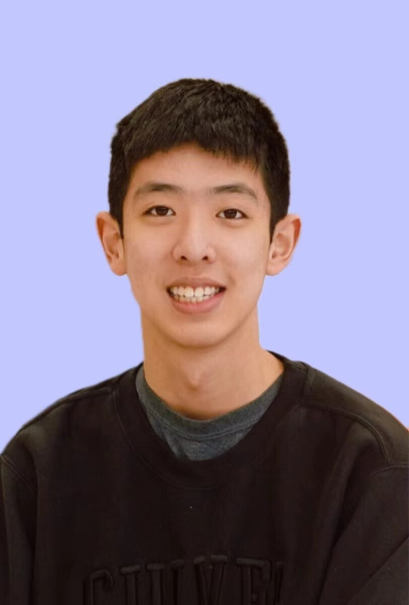
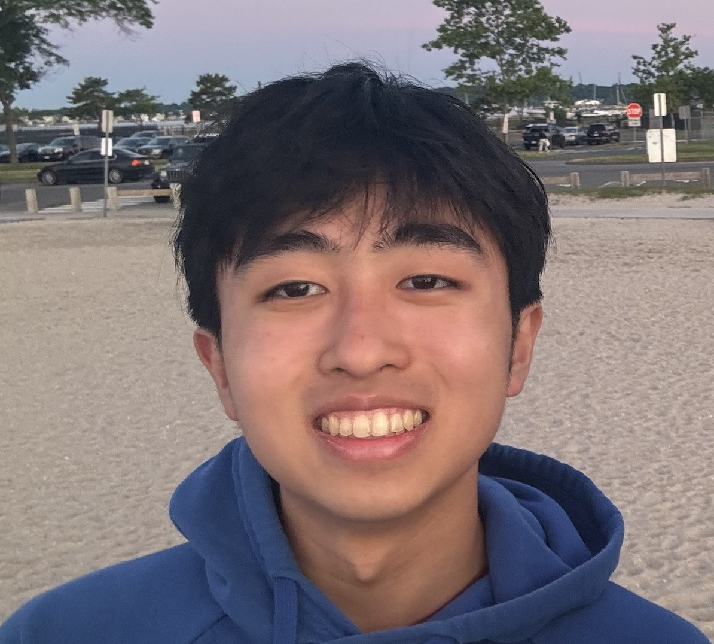

```{=html}
<style>
table{
  border-collapse: collapse;
  border-spacing: 0;
}
</style>
```

# Current

|  |  |
|:-------------------------------------:|:--------------------------------|
|  | [Jacqueline R. Thompson]{.h4} <br> Postdoc <br> Biostatistics <br> \[[Linkedin](https://www.linkedin.com/in/jacqueline-r-thompson-6a478a159/)\] |
|  | [Alyssa Columbus]{.h4} <br> PhD student <br> Biostatistics <br> \[[Linkedin](https://www.linkedin.com/in/acolum/)\] \[[Website](https://alyssacolumbus.com/)\] \[[Vivien Thomas Scholar](https://provost.jhu.edu/about/vivien-thomas-scholars-initiative/)\] \[[Student Spotlight](https://publichealth.jhu.edu/2024/student-spotlight-alyssa-columbus)\] |
|  | [Cindy Fang]{.h4} <br> PhD student <br> Biostatistics <br> \[[Linkedin](https://www.linkedin.com/in/cindyfang1/)\] \[[Website](https://cindyfang70.github.io/)\] |
|  | [Jan Matthias]{.h4} <br> PhD student <br> Biomedical Informatics and Data Science <br> \[[Linkedin](https://www.linkedin.com/in/janmatthias)\] \[[Website](https://janmatthias1.github.io)\] |
|  | [Omodolapo Nurudeen]{.h4} <br> PhD student <br> Biomedical Engineering <br> \[[Linkedin](https://www.linkedin.com/in/omodolapo-nurudeen/)\] \[[Vivien Thomas Scholar](https://provost.jhu.edu/about/vivien-thomas-scholars-initiative/)\] |
|  | [Sowmya Parthiban]{.h4} <br> PhD student <br> Biostatistics <br> \[[Linkedin](linkedin.com/in/sowmya-parthiban)\] \[[Website](https://sowmya-parthiban.com)\] |
|  | [Jianing Yao]{.h4} <br> PhD student <br> Biostatistics <br> \[[Linkedin](https://www.linkedin.com/in/jianing-yao-15156211b/)\] |
|  | [Tingjun Chen]{.h4} <br> ScM student <br> Biostatistics <br> \[[Linkedin](https://www.linkedin.com/in/tingjun-chen-a19320343)\] |
|  | [Xingyi (Daniel) Chen]{.h4} <br> Undergraduate research assistant <br> Applied Math and Statistics <br> Computational Medicine <br> \[[Linkedin](https://www.linkedin.com/in/xingyi-chen-8291381a5/)\] \[[MSKCC QSURE Awardee](https://www.mskcc.org/departments/epidemiology-biostatistics/educational-opportunities/quantitative-sciences-summer-undergraduate-research-experience-qsure)\] |
|  | [Chris Du]{.h4} <br> Undergraduate research assistant <br> Biomedical Engineering <br> Applied Math and Statistics <br> \[[Linkedin](https://www.linkedin.com/in/christopher-du-987211265/)\] |

<br>

# Alumni

## Postdoc Alumni

- [Michael Totty](https://mictott.github.io/) \| 2026 \| Next: Research Scientist, Lieber Institute for Brain Development
  - [NIH/NIMH F32 awardee](https://reporter.nih.gov/search/T6djbB-iu0G7R933Rb0WYw/project-details/10999104) \| [NIH/NIMH K99/R00 awardee](https://reporter.nih.gov/search/9KlZS31X_U68Rt4oxFvvbA/project-details/11283284)
- [Boyi Guo](https://boyiguo1.github.io) \| 2025 \| Next: Assistant Professor, University of Utah, Biostatistics
- [Sean Maden](https://metamaden.github.io/) \| 2024 \| Next: Senior Data Analyst
- [Lukas Weber](https://lmweber.github.io) \| 2023 \| Next: Assistant Professor, Boston University, Biostatistics
  - [NIH/NHGRI K99/R00 awardee](https://reporter.nih.gov/search/jo9zCTW54U2AcHyPnvczFw/project-details/10350850)
- [Wenpin Hou](https://winnie09.github.io/Wenpin_Hou/) \| 2022 \| Next: Assistant Professor, Columbia University, Biostatistics 
  - [NIH/NHGRI K99/R00 awardee](https://reporter.nih.gov/search/lFjtiEHahE2RP8mEYpFK1g/project-details/10104023)

## PhD Alumni

- [Kinnary Shah](https://www.linkedin.com/in/kinnary-shah) \| [Student Spotlight](https://publichealth.jhu.edu/departments/biostatistics/people/brain-mapping-and-bias) \| 2026 \| Next: Manager, Pfizer
- [Erik Nelson](https://www.linkedin.com/in/erik-david-nelson) \| 2024 \| Next: Computational Biologist, Translational Omics at GSK
- [Albert Kuo](https://albertkuo.me) \| 2022 \| Next: Data Scientist, Amazon

## Masters Alumni

- [Shengyi Li](https://www.linkedin.com/in/shengyi-l-7b358324b) \| 2026 \| Next: PhD student, Yale University
- [Harriet (Jiali) He](https://www.linkedin.com/in/harriet-he-a5ba4b21b) \| 2026 \| Next: PhD student, University of Texas MD Anderson
- [Guan Gui](https://www.linkedin.com/in/guan-gui-ab4b93217/) \| 2026 \| Next: PhD student, Swiss Federal Technology Institute of Lausanne (EPFL)
- [Vani Padmakumar](https://www.linkedin.com/in/vani-padmakumar-79880a22b) \| 2026 \| Next: Data scientist, Thermofisher
- [Christine Hou](https://www.linkedin.com/in/christine-yiru-hou-086439221/) \| 2025 \| Next: PhD student, University of Wisconsin-Madison
- [Shu Luan](https://www.linkedin.com/in/shu-luan-a60a391a0/) \| 2025 \| Next: PhD student, University of Chicago
- [Weishan Li](https://www.linkedin.com/in/weishan-li-b57950307/) \| 2024 \| Next: PhD student, University of Colorado
- [Haowen Zhou](https://pixel-dream.github.io/) \| 2023 \| Next: PhD student, UC San Diego
- [Jianing Yao](https://www.linkedin.com/in/jianing-yao-15156211b/) \| 2023 \| Next: PhD student, Johns Hopkins
- [Yongbao Zhuang](https://yzhuang8.com/home/) \| 2022 \| Next: PhD student, Karolinska Institute
- [Nathan Dyjack](https://ntdyjack.github.io/) \| 2021 \| Next: Data Scientist, UAB Medical Center ([Alumni Spotlight](https://publichealth.jhu.edu/2025/alumni-spotlight-nathan-dyjack-scm-22))

## Rotation Alumni

- Jon Sundstrom \| 2026
- Omodolapo Nurudeen \| 2025
- Grace Brooks \| 2025
- Caleb Hallinan \| 2024
- Rafael dos Santos Peixoto \| 2022
- Chaichontat Sriworarat \| 2022

## Undergraduate Alumni

- Yilin Chen \| 2022
- Cynthia Lo \| 2022

## Past Research Assistants

- Michael Ontiveros
- Kexin (Sheena) Wang
- Ruoxi Liu
- Alexandra Stephens
- Hanchao (Ted) Zhang
- Pei-Lun (Perry) Kuo

## Former Friends of the Lab (FFOL)

- [Prashanthi Ravichandran](https://www.linkedin.com/in/prashanthi-ravichandran-96a363a0)
- [Anthony Ramnauth](https://www.linkedin.com/in/anthonyramnauth/)
- [Madhavi Tippani](https://www.linkedin.com/in/madhavi-tippani/)
- [Siqi (Alice) Chen](https://bcmb.bs.jhmi.edu/people/siqi-alice-chen)
- [Carrie Wright](https://carriewright11.github.io/)

## Visitors

- [Andrea Sottosanti](https://andreasottosanti.github.io) \| 2022