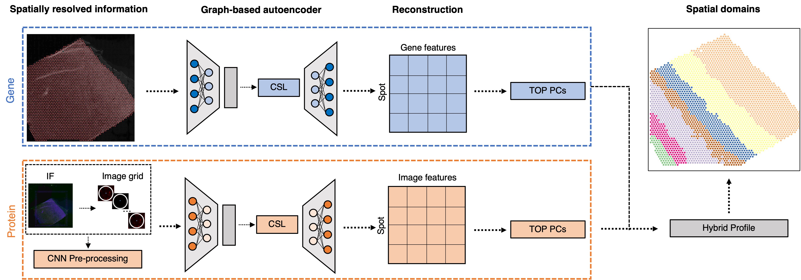
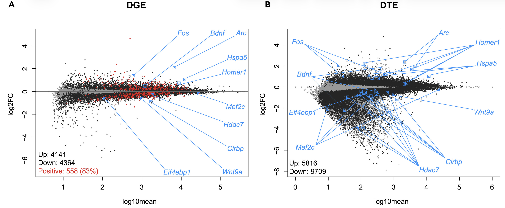
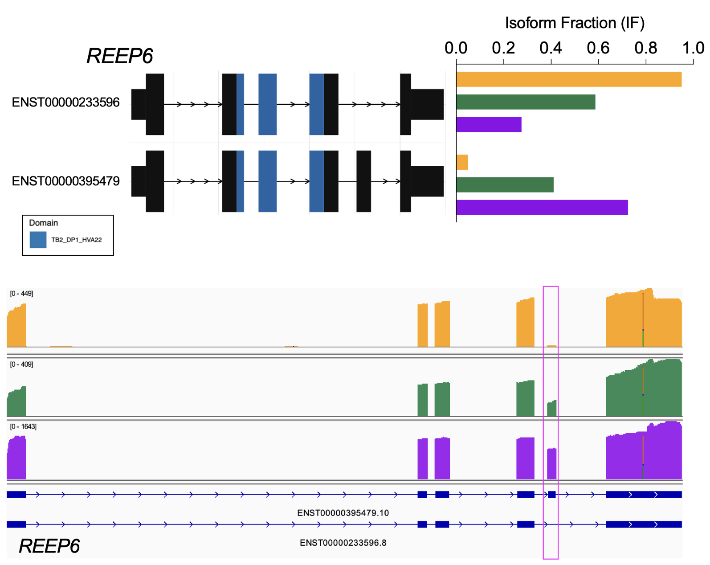

## Computational methods for single-cell and spatial omics

{fig-alt="Quality control with spotsweeper" width="100%"}

Single-cell and spatial omics technologies have become the most widely used high-throughput method for profiling RNA or proteins from individual cells either dissociated or in a 2D resolution. However, these technologies also bring new computational and methodological challenges. We develop computational tools to remove systematic errors and biases, such as related to sparsity or technical artifacts. In addition, we contribute scalable statistical and machine learning algorithms including data storage, data visualization, feature selection, and unsupervised clustering algorithms.

Our methods that we develop for single-cell or spatial omics raise important questions around how to choose computational methods that are well-tested and trusted by the community. Also, we benchmark and systematically evaluate computational methods for their accuracy, usability and reproducibility. To support broad accessibility, we write online [books](teaching.qmd) to teach users how to make use of these state-of-the-art tools computational tools. 

---

## Deep learning and genomics

{fig-alt="Predicting discrete spatial domains using spatial multi-omics data (Yao et al., 2025, Genome Research)" width="100%"}

We develop state-of-the-art deep learning algorithms using generative models, contrastive self-supervised learning, and transformers to improve downstream tasks. Examples include: 

-   Predict tasks using multi-modal single-cell and spatial data
-   Integrate and align multiple tissue sections to create 3D spatial atlases
-   Fine tune sequence to function models for downstream spatial omics data analysis tasks

---

## Post-transcriptional gene regulation

Most single-cell RNA-sequencing and spatially-resolved transcriptomics datasets are generated with short-read sequencing. By design, short-reads generated from most commercial platforms tag the extreme ends of the cDNA, primarily providing gene-level estimates. However, understanding post-transcriptional gene regulation is crucial for understanding human development and disease. We investigate how alternative splicing and RNA modifications change across development, the lifespan, and in disease. We also develop novel computational tools motivated through challenges of analyzing these data.

### Alternative splicing across sleep deprivation 

We collaborate with the [Peixoto lab](https://labs.wsu.edu/peixoto-lab/home/dr-lucia-peixoto/) and [Risso lab](https://drisso.github.io/) to investigate how gene expression changes with sleep and cogitative impairments within Autism Spectrum Disorders. 

For example, using bulk and single-nuclei RNA-sequencing data, we found that sleep deprivation predominantly represses transcription at the gene and transcript level. We also found it leads to isoform switching (a type of alternative splicing) of more than 1500 genes and it also preferentially affects glutamatergic neurons. 

{fig-alt="Sleep deprivation predominately represses transcription at the gene and transcript level" width="100%"}

### Alternative splicing across development 

We collaborate with the [Zack lab](https://scholar.google.com/citations?user=frmlZdAAAAAJ&hl=en) and the [Timp lab](https://scholar.google.com/citations?user=wTEx9N8AAAAJ&hl=en) to generate and analyze long-read RNA-sequencing to investigate gene expression in retinal ganglion cells, the cells whose death in glaucoma leads to visual loss and potentially blindness.

For example, using nanopore-based long-read RNA-sequencing (direct cDNA) on differentiating human stem cell-derived retinal organoids, we identified temporal patterns of isoform usage across developmental stages (Stage 1, 2, 3 -- yellow, green, purple, respectively). We found that retinal organoids undergo dynamic shifts in isoform usage throughout differentiation, which were not necessarily accompanied with changes in overall gene expression, as was the case for many genes involved in the regulation of mRNA splicing itself. 

{fig-alt="Example of temporally regulated isoform switching REEP6, a retinal disease gene" width="90%"}

### RNA modifications

RNA modifications are post-transcriptional chemical changes of nucleotides in RNA molecules (collectively referred to the "epitranscriptome") that can change their properties, including their statiblity, splicing, cellular localization, structure, or recruitment of splicing factors. Using new experimental techniques like nanopore sequencing, this now allow us to directly sequence RNA molecules (native RNA) without the need for reverse transcription into cDNA or PCR amplification. Because of this, modifications to the RNA bases are retained and can be detected when sequencing these native RNA transcripts. 

Most recently, studies have begun to investigate how the epitranscriptomics infludences influences complex processes in the central nervous system (CNS), including neurogenesis, synapse formation, and neurodegeneration. However, this new data type comes with many computational challenges. We are working closely with collaborators to not only develop new computational methods, but also to use nanopore sequencing to resolve epitranscriptomic landscapes of the CNS in the context of the human retina, aging, and neurodegneerative disease processes. 

---

## Neuropsychiatric and neurodegenerative disorders

Our lab closely collaborates with biologists and neuroscientists to use single-cell and spatial omics technologies to profile gene expression and proteins from postmortem human brain tissue to better understand the molecular mechanisms of neuropsychiatric and neurodegenerative disorders along with substance abuse disorders. We are part of the [PsychENCODE Project](https://www.psychencode.org/phase-ii), [HuBMAP](https://hubmapconsortium.org/), and collaborate with researchers at the [Lieber Institute for Brain Development](https://www.libd.org), in particular the labs of [Keri Martinowich](https://www.libd.org/team/keri-martinowich-phd/), [Kristen Maynard](https://www.libd.org/team/kristen-maynard-phd/), and [Stephanie Page](https://www.libd.org/team/stephanie-cerceo-page-phd/), on a variety of projects. 

## Cancer

We collaborate with [Greene lab](https://greenelab.com/members/casey-greene.html) and [Doherty lab](https://uofuhealth.utah.edu/huntsman/labs/doherty) studying biological basis of subtypes of high-grade serous ovarian cancers (HGSOC) using bulk RNA-seq, scRNA-seq, and spatial transcriptomics data. This is highly relevant to public health because HGSOC is a particularly deadly cancer that is often only identified at late stage and treatment options are limited. The long-term impact of this project will be a key step towards developing targeted treatments for HGSOCs.

---

## Reproducible research in biomedical data science

With the advent of large-scale and high-throughput data collection coupled with the creation and implementation of complex statistical algorithms for data analysis, the reproducibility of modern data analyses has become an important topic of discussion. I have contributed to developing reproducibility standards for machine learning in the life sciences, and also in public health. Finally, I develop practical guides and resources for data science education.

### Open-source software development 

In addition to developing statistical methods, we care deeply about implementing our computational methods in [open-source software](software.qmd). Bioconductor is an open-source, open-development software project in the R programming language for the analysis and comprehension of high-throughput genomics and molecular biology data. We contribute open-source software to CRAN and to [Bioconductor](https://bioconductor.org/), which helps make our computational methods broadly accessible to the research community.

### Benchmarking and reproducibility

Benchmarking and evaluting open-source software packages for their accuracy, usability and reproducibility is also important to us. We have led systematic benchmark comparsions of:

-   Computational methods that control the false discovery rate (FDR)
-   Computational methods for scRNA-seq imputation

---

## Data science education

An increase in demand for statistics and data science education has led to changes in curriculum, specifically an increase in computing. While this has led to more applied courses, students still struggle with effectively deriving knowledge from data and solving real-world problems. In 1999, Deborah Nolan and Terry Speed argued the solution was to teach courses through in-depth case studies derived from interesting scientific questions with nontrivial solutions that leave room for different analyses of the data. This innovative framework teaches the student to make important connections between the scientific question, data and statistical concepts that only come from hands-on experience analyzing data.

### Open Case Studies

To address this, we built the [Open Case Studies](https://www.opencasestudies.org) (OCS) data science educational resource of case studies that educators can use in the classroom to teach students how to effectively derive knowledge from data. This project was selected as a [High-Impact Project](https://americanhealth.jhu.edu/open-case-studies) in 2019-2020 by the Bloomberg American Health Initiative and Bloomberg Philanthropies.

<iframe width="560" height="315" src="https://www.youtube.com/embed/DgzBSOY5Yc8" frameborder="0" allowfullscreen>

</iframe>

### Analytic Design Theory

The data science revolution has led to an increased interest in the practice of data analysis. While much has been written about *statistical thinking*, a complementary form of thinking that appears in the practice of data analysis is *design thinking* -- the problem-solving process to understand the people for whom a product is being designed.

[Analytic Design Theory](https://analyticdesigntheory.org/) is the study of how data analyses are conducted in the real world taking into account both the perspectives of both the analyst and the stakeholder or consumer of the analysis. Aspects of this include characterizing variation between analyses, developing measures of quality, success, and usability, modeling the analytic process, and considering what makes data analyses more or less trustworthy. Analytic design theory is driven by the need to scale the training of data analysis and to continuously improve the quality of analyses.